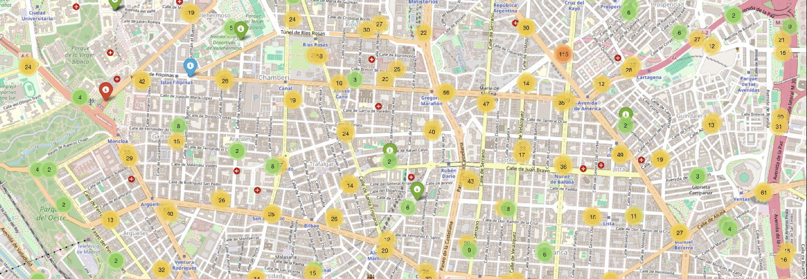

# Madrid Accident Map 2024

This project aims to display an **interactive map** of accidents that occurred in the city of Madrid during the year 2024. Additionally, it includes visualizations and analysis of accident data to better understand the distribution and severity of accidents in the region.

## Description

The project consists of:
1. **Interactive Map**: An interactive map created with folium, which allows visualizing the location of the accidents. The accidents have been classified according to their severity (fatalities, injuries, and without medical assistance).
2. **Visualisations**: Graphs that show relevant statistics, such as:
- Number of accidents by district.
- Number of accidents by type of vehicle.
- Accidents with or without alcohol/drug consumption.
- Distribution of accidents by time of day.
- Accident frequency by day of the week.
- Ages of individuals involved in accidents.
- Accidents by weather conditions.

The purpose of this project is to facilitate the analysis of accident data and provide a visual tool to explore their distribution in the city.

## Requirements

To run this project in your local environment, you need to install the following Python libraries:

- `pandas`: For data manipulation and analysis.
- `numpy`: For mathematical operations and array handling.
- `folium`: For creating interactive maps.
- `matplotlib`: For creating plots.
- `seaborn`: For advanced data visualisation.
- `pyproj`: For converting UTM coordinates to geographic (latitude and longitude).

## Usage of the Interactive Map
The map allows interaction with the different categories of accidents, grouped by severity:

Accidents with Fatalities: Markers in red.
Accidents with Injuries: Markers in blue.
Accidents without Medical Assistance: Markers in green.
You can enable or disable the visualization of each group using the layer control in the upper right corner of the map. By clicking on each marker, detailed information about the accident is displayed, such as the date, time, location, and type of accident.

## Contributions
If you want to contribute to this project, please follow these steps:

Fork the repository.
Create a new branch (git checkout -b feature/new-feature).
Make your changes and commit (git commit -am 'Add new feature').
Push your changes to your repository (git push origin feature/new-feature).
Create a Pull Request and describe the proposed changes.
License
This project is licensed under the MIT License. See the LICENSE file for more details.

## You can view the map here:
https://nachojacquot.com/dataprojects/mapa_accidentes_madrid/mapa.html

## Contact
If you have any questions or suggestions, feel free to contact me at fiodornac@gmail.com.
